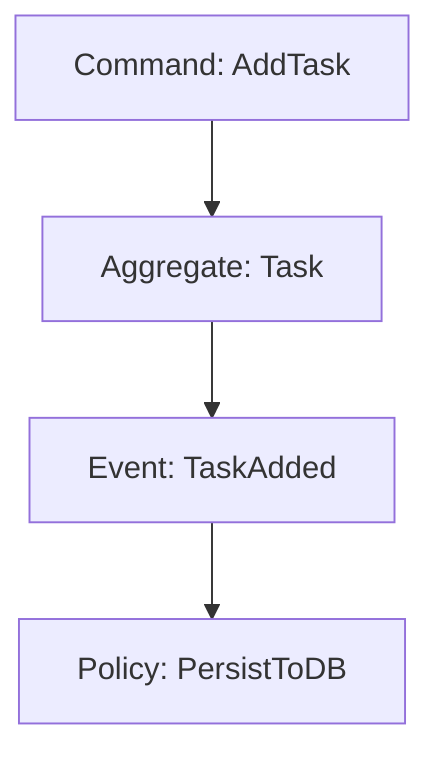

# SovereignSpecAI
> SovereignSpecAI is a local, technology-agnostic AI coding orchestrator designed as a strict alternative to cloud-dependent agents (like Claude Code or Junie). It allows you to build professional software on consumer hardware without leaking intellectual property.

## The Core Philosophy
Local LLMs often struggle with massive codebases due to context window limits and reasoning constraints. SovereignSpecAI solves this by enforcing architectural discipline before a single line of code is written.

- **DDD/EDD Driven**: We use Domain-Driven Design and Event-Driven Architecture (via Mermaid diagrams and specs) to break down complex systems into atomic, strictly bounded tasks.
- **Local-First Orchestration**: Powered by Ollama and `aider`, agents operate entirely on your machine. Your IP never leaves your hardware.
- **Technology Agnostic**: The architecture dictates the logic; the agents adapt to your chosen stack (Rust, Go, TypeScript, C++, etc.).
- **KISS & Clean Code**: The pipeline enforces a strict Kanban lifecycle (Icebox -> Backlog -> Review -> Done), preventing AI over-engineering and ensuring continuous human-in-the-loop review.

## The Vision
SovereignSpecAI is a lightweight, local-first orchestration layer for Spec-Driven Development (SDD). It turns a standard Linux machine with 16GB VRAM into an autonomous code factory.

## The Stack
- **Orchestration:** Streamlit Dashboard
- **Brain:** Ollama (Qwen2.5-Coder 14B / Codestral 22B)
- **Execution:** Aider CLI (Architect Mode)
- **Context:** Local RAG via Repo-Map
- **Methodology:** Domain-Driven Design (DDD) & Event-Driven Development (EDD).

## Workflow

### Blueprinting
Create your domain model using Mermaid syntax. Define your Bounded Contexts, Domain Events, and Commands.


### Example
See [Project Blueprint](architecture-example/project_blueprint.md) for a concrete example. This file describe a simple task manager running in a Web browser (no backend involved).
### The Kanban Factory
Move your specs through the industrial pipeline:

* **Icebox**: Ideation and raw specs.
* **Backlog**: Approved tasks ready for the agents.
* **Dev**: Active coding by your local Ollama server.
* **Review**: Human-in-the-loop diff checking and build validation.
* **Done**: Production-ready code merged into main.

## Getting Started
### Prerequisites
* A Linux machine (to act as a server) with Ollama installed.
* Python 3.10+
* Aider installed (`pip install aider-chat`)

### Installation
#### 0. Initialize your own project, minimally:
```bash
mkdir my-project-to-be-built-by-robots
cd my-project-to-be-built-by-robots
git init .
```

#### 1. Inside your project, clone the `sovereign-spec-ai` repository:
```bash
git clone https://github.com/esavard/sovereign-spec-ai.git
cd sovereign-spec-ai
```
#### 2.0 Install uv (if not already installed)
```bash
curl -LsSf https://astral.sh/uv/install.sh | sh
```
#### 2. Setup the environment with `uv`:
```bash
# Sync dependencies and create .venv
uv sync
```
#### 3. Run the Dashboard:
```bash
# Use 'uv run' to execute within the virtual environment
uv run streamlit run dashboard.py
```
#### 4. Initialize Factory:
Once the dashboard is open in your browser, click the "Initialize Environment" button in the sidebar. This will create the Kanban folder structure and prepare your local Git branches.

## Why Sovereign?
* **Data Privacy**: Your source code never leaves your local network. No cloud training, no leaks.
* **Cost Control**: Zero subscription fees. Pay for the electricity, keep the results.
* **Political Resilience**: Independent of 3rd-party API availability or regional policy changes.

## Contributing
see [CONTRIBUTING.md](./CONTRIBUTING.md)

## Licensing
This project is licensed under the [MIT License](./LICENSE).
