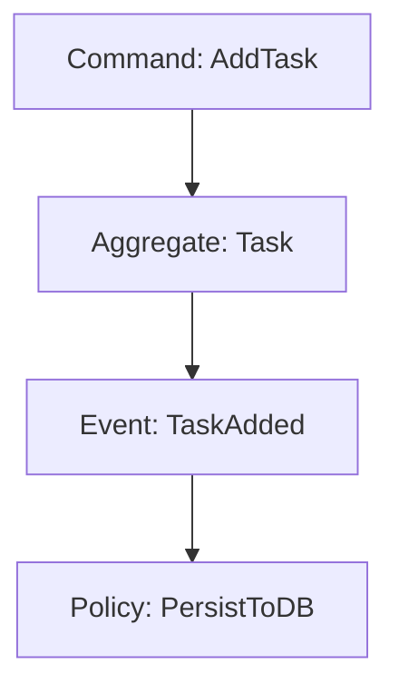

# SovereignSpecAI
> SovereignSpecAI is a local, technology-agnostic AI coding orchestrator designed as a strict alternative to cloud-dependent agents (like Claude Code or Junie). It allows you to build professional software on consumer hardware without leaking intellectual property.

## The Core Philosophy
Local LLMs often struggle with massive codebases due to context window limits and reasoning constraints. SovereignSpecAI solves this by enforcing architectural discipline before a single line of code is written.

- **Architecture First**: No agent writes code until the domain model is fully specified. A Mermaid blueprint defines Bounded Contexts, Aggregates, Events, and Commands. The Architect agent decomposes it into an ordered, dependency-aware backlog. Code generation follows the architecture — never the other way around.
- **DDD/EDD Driven**: We use Domain-Driven Design and Event-Driven Architecture (via Mermaid diagrams and specs) to break down complex systems into atomic, strictly bounded tasks.
- **Local-First Orchestration**: Powered by Ollama and `aider`, agents operate entirely on your machine. Your IP never leaves your hardware.
- **Technology Agnostic**: The architecture dictates the logic; the agents adapt to your chosen stack (Rust, Go, TypeScript, C++, etc.).
- **KISS & Clean Code**: The pipeline enforces a strict Kanban lifecycle (Backlog → Dev → Review → Done), preventing AI over-engineering and ensuring continuous human-in-the-loop review.

## The Vision
SovereignSpecAI is a lightweight, local-first orchestration layer for Spec-Driven Development (SDD). It turns a standard Linux machine with 16GB VRAM into an autonomous code factory — one where humans define the architecture and AI executes it, never the reverse.

## The Stack
- **Orchestration:** Python CLI/TUI (`sovereign` command, powered by `rich`)
- **Brain:** Ollama (Qwen2.5-Coder 14B / Codestral 22B)
- **Execution:** Aider CLI
- **Context:** Local RAG via Repo-Map
- **Methodology:** Domain-Driven Design (DDD) & Event-Driven Development (EDD)

## Workflow

### Blueprinting
Create your domain model using Mermaid syntax. Define your Bounded Contexts, Domain Events, and Commands.



### Example
See [Project Blueprint](architecture-example/project_blueprint.md) for a concrete example. This file describe a simple task manager running in a Web browser (no backend involved).

### The Kanban Pipeline
The pipeline is a strict state machine with explicit human-in-the-loop gates.

| Stage | Who acts | Description |
|---|---|---|
| `01_backlog` | Architect agent | Raw tasks generated from the Blueprint. |
| `02_ready_for_dev` | **Human** | Task manually promoted, cleared for development. |
| `03_ready_for_review` | Developer agent | Implementation complete, awaiting review. |
| `04_dev_done` | Reviewer agent | Review verdict delivered, awaiting acceptance. |
| `05_done` | **Human** | Accepted, feature branch merged and closed. |

## Getting Started

### Prerequisites
* A Linux machine with Ollama installed and a model pulled (e.g. `ollama pull qwen2.5-coder:14b-instruct-q4_K_M`)
* Python 3.12+
* `uv` package manager

### Installation

#### 1. Initialize your project repository
```bash
mkdir my-project
cd my-project
git init .
```

#### 2. Clone SovereignSpecAI as a sidecar
```bash
git clone https://github.com/esavard/sovereign-spec-ai.git
cd sovereign-spec-ai
```

#### 3. Install uv (if not already installed)
```bash
curl -LsSf https://astral.sh/uv/install.sh | sh
```

#### 4. Install dependencies and register the CLI
```bash
uv sync
```
This installs all dependencies and registers the `sovereign` command in the virtual environment.

#### 5. Initialize the Kanban folder structure
```bash
uv run sovereign init
```
This creates the `specs/` stage directories, a default `architecture/project_blueprint.md`, configures `.gitignore` and `.aiderignore`, and automatically creates an initial commit if the repository has none yet.

## CLI Reference

All commands are run with `uv run sovereign <command>`.

| Command | Arguments | Description |
|---|---|---|
| `init` | — | Initialize the Kanban folder structure, default blueprint, `.gitignore`, and `.aiderignore` in the parent repository. Run once after cloning. |
| `architect` | `[--blueprint FILE]` | Run the Architect agent against a blueprint. Decomposes it into atomic, dependency-ordered tasks written to `01_backlog/` with a numeric priority prefix (`01_`, `02_`, …). Defaults to `architecture/project_blueprint.md`. |
| `list` | `[stage]` | List spec files in a Kanban stage. Defaults to `01_backlog`. Valid stages: `01_backlog`, `02_ready_for_dev`, `03_ready_for_review`, `04_dev_done`, `05_done`. |
| `pick` | `<filename>` | **[Human gate 1]** Promote a task from `01_backlog` to `02_ready_for_dev`. |
| `run` | `<filename>` | Trigger the Developer agent on a task in `02_ready_for_dev`. Creates a git branch, runs `aider`, and moves the task to `03_ready_for_review` on success. |
| `review` | `<filename> [--no-agent]` | Trigger the Reviewer agent on a task in `03_ready_for_review`. Moves to `04_dev_done` on completion. Pass `--no-agent` to show the diff only. |
| `approve` | `<filename>` | **[Human gate 2]** Merge the feature branch and move the task to `05_done`. |
| `reject` | `<filename> [--reason TEXT]` | Send a task from `03_ready_for_review` back to `01_backlog`. Appends feedback to the spec if `--reason` is provided. |

### Examples

```bash
# 1. Initialize the sidecar in your project (run once)
uv run sovereign init

# 2. Analyze the blueprint and populate the backlog
uv run sovereign architect
uv run sovereign architect --blueprint architecture/my_other_blueprint.md

# 3. [Human gate 1] Review generated tasks and promote one for development
uv run sovereign list 01_backlog
uv run sovereign pick 01_setup_database.md   # moves to 02_ready_for_dev

# 4. Trigger the Developer agent
uv run sovereign run 01_setup_database.md    # auto-moves to 03_ready_for_review

# 5. Trigger the Reviewer agent
uv run sovereign review 01_setup_database.md           # runs agent, moves to 04_dev_done
uv run sovereign review 01_setup_database.md --no-agent  # diff only

# 6. [Human gate 2] Accept and merge
uv run sovereign approve 01_setup_database.md  # merges branch, moves to 05_done

# Or reject back to backlog with feedback
uv run sovereign reject 01_setup_database.md --reason "Missing error handling in repository layer."
```

## Why Sovereign?
* **Data Privacy**: Your source code never leaves your local network. No cloud training, no leaks.
* **Cost Control**: Zero subscription fees. Pay for the electricity, keep the results.
* **Political Resilience**: Independent of 3rd-party API availability or regional policy changes.

## Contributing
See [CONTRIBUTING.md](./CONTRIBUTING.md).

## Licensing
This project is licensed under the [MIT License](./LICENSE).