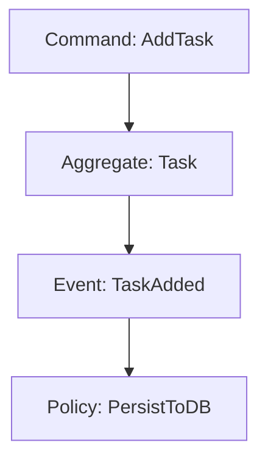
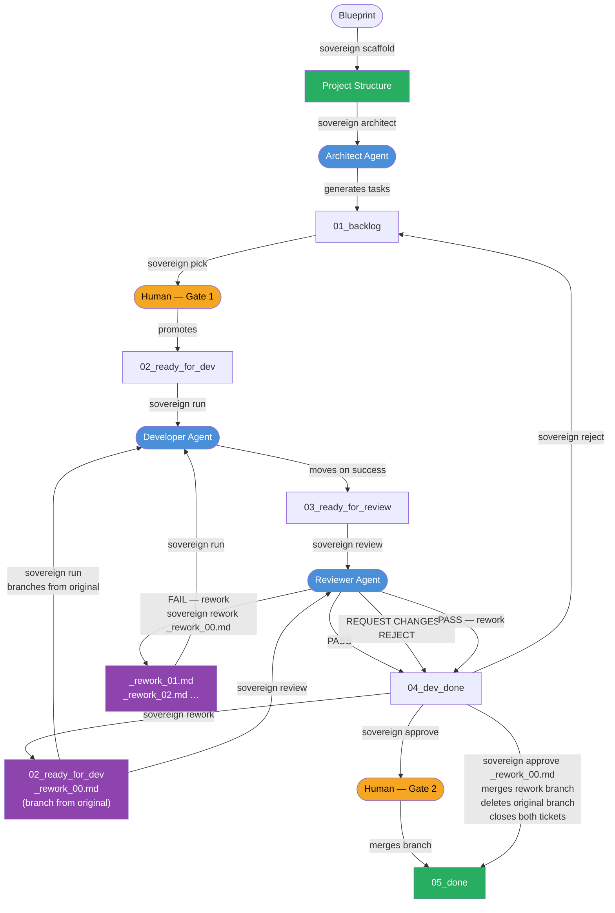

# SovereignSpecAI
> SovereignSpecAI is a local, technology-agnostic AI coding orchestrator designed as a strict alternative to cloud-dependent agents (like Claude Code or Junie). It allows you to build professional software on consumer hardware without leaking intellectual property.

## The Core Philosophy
Local LLMs often struggle with massive codebases due to context window limits and reasoning constraints. SovereignSpecAI solves this by enforcing architectural discipline before a single line of code is written.

- **Architecture First**: No agent writes code until the domain model is fully specified. A Mermaid blueprint defines Bounded Contexts, Aggregates, Events, and Commands. The Architect agent decomposes it into an ordered, dependency-aware backlog. Code generation follows the architecture — never the other way around.
- **DDD/EDD Driven**: We use Domain-Driven Design and Event-Driven Architecture (via Mermaid diagrams and specs) to break down complex systems into atomic, strictly bounded tasks.
- **Local-First Orchestration**: Powered by Ollama and `aider`, agents operate entirely on your machine. Your IP never leaves your hardware.
- **Technology Agnostic**: The architecture dictates the logic; the agents adapt to your chosen stack (Rust, Go, TypeScript, C++, etc.).
- **KISS & Clean Code**: The pipeline enforces a strict Kanban lifecycle (Backlog → Dev → Review → Done), preventing AI over-engineering and ensuring continuous human-in-the-loop review.

## The Vision
SovereignSpecAI is a lightweight, local-first orchestration layer for Spec-Driven Development (SDD). It turns a standard Linux machine with 16GB VRAM into an autonomous code factory — one where humans define the architecture and AI executes it, never the reverse.

## The Stack
- **Orchestration:** Python CLI/TUI (`sovereign` command, powered by `rich`)
- **Brain:** Ollama (Qwen2.5-Coder 14B / Codestral 22B)
- **Execution:** Aider CLI
- **Context:** Local RAG via Repo-Map
- **Methodology:** Domain-Driven Design (DDD) & Event-Driven Development (EDD)

## Workflow

### Blueprinting
Create your domain model using Mermaid syntax. Define your Bounded Contexts, Domain Events, and Commands.



### Example
See [Project Blueprint](architecture-example/project_blueprint.md) for a concrete example. This file describe a simple task manager running in a Web browser (no backend involved).

### The Kanban Pipeline
The pipeline is a strict state machine with explicit human-in-the-loop gates.

| Stage | Who acts | Description |
|---|---|---|
| `01_backlog` | Architect agent | Raw tasks generated from the Blueprint. |
| `02_ready_for_dev` | **Human** | Task manually promoted, cleared for development. |
| `03_ready_for_review` | Developer agent | Implementation complete, awaiting review. |
| `04_dev_done` | Reviewer agent | Review verdict delivered, awaiting acceptance. |
| `05_done` | **Human** | Accepted, feature branch merged and closed. |



## Getting Started

### Prerequisites
* A Linux machine with Ollama installed and a model pulled (e.g. `ollama pull qwen2.5-coder:14b-instruct-q4_K_M`)
* Python 3.12+
* `uv` package manager

### Installation

#### 1. Install uv (if not already installed)
```bash
curl -LsSf https://astral.sh/uv/install.sh | sh
```

#### 2. Initialize your project repository
```bash
mkdir my-project
cd my-project
git init .
git commit --allow-empty -m "chore: initial commit"
```

#### 3. Clone SovereignSpecAI as a sidecar inside your project
```bash
git clone https://github.com/esavard/sovereign-spec-ai.git
cd sovereign-spec-ai
uv sync
```
`uv sync` installs all dependencies and registers the `sovereign` command in the virtual environment.

#### 4. Initialize the Kanban folder structure
```bash
uv run sovereign init
```
This creates the `specs/` stage directories, a default `architecture/project_blueprint.md`, configures `.gitignore` and `.aiderignore` (including hiding the `sovereign-spec-ai/` sidecar from the parent repo's git status), and creates an initial commit if the repository has none yet.

#### 5. Customize the blueprint and commit it
Edit `architecture/project_blueprint.md` to describe your project. Fill in the Project Name, Domain Description, Technical Stack, Technical Constraints, and the Mermaid domain model. Take special care to define precisely your features in the diagram — the Architect agent uses it as the sole source of truth for scoping tasks. See the [architecture-example](architecture-example/project_blueprint.md) directory for a concrete reference.

Once satisfied, commit the blueprint:
```bash
cd ..   # back to my-project root
git add architecture/project_blueprint.md
git commit -m "docs: define project blueprint"
```

#### 6. Scaffold the project structure
```bash
uv run sovereign scaffold
```
Reads the `Technical Stack` section of your blueprint and deterministically generates the project structure: config files (`package.json`, `go.mod`, `build.gradle.kts`, …), DDD directory layout with `.keep` files, a merged `.gitignore` (preserving any entries added by `sovereign init`), and a root `Makefile` for monorepos. Everything is committed on a `init_project` branch for review. No LLM is involved — the output is fully reproducible.

## Model Configuration

Every agent role (`architect`, `developer`, `reviewer`) reads its model from `factory_config.yaml` (`default_model`, with optional per-role `model_overrides`). By default every role runs against a local Ollama model — nothing leaves your machine.

Each role tends to perform better with a different model, since the roles place different demands on a model:

- **architect** — needs strong long-context planning and instruction-following to decompose a blueprint into a correctly ordered task graph.
- **developer** — needs fast, accurate code generation that sticks closely to the spec.
- **reviewer** — needs careful, code-focused critique rather than raw generation speed.

`factory_config.yaml` ships with a model assigned to each role accordingly:

```yaml
model_overrides:
  architect: "ollama/devstral-small-2:24b-instruct-2512-q4_K_M"
  developer: "ollama/qwen2.5-coder:14b-instruct-q4_K_M"
  reviewer:  "ollama/codestral:22b-v0.1-q4_K_M"
```

Swap any of these for another local Ollama model, or override per role as described below.

### Optional: connecting a role to the Claude API

You can point any single role at an Anthropic Claude model instead of a local one — for example to validate a local model's review verdicts against Claude, or to benchmark how a local model's implementation compares to Claude's on the same spec. This is opt-in per role; roles left on `ollama/...` stay fully local.

1. Get an API key from the [Anthropic Console](https://console.anthropic.com/) and export it in the shell that runs `sovereign`:
   ```bash
   export ANTHROPIC_API_KEY="sk-ant-..."
   ```
2. In `factory_config.yaml`, set the role's model to `anthropic/<model-id>` (e.g. `anthropic/claude-sonnet-4-6`, `anthropic/claude-opus-4-8`):
   ```yaml
   model_overrides:
     architect: "ollama/devstral-small-2:24b-instruct-2512-q4_K_M"
     developer: "ollama/qwen2.5-coder:14b-instruct-q4_K_M"
     reviewer:  "anthropic/claude-sonnet-4-6"   # validate the local developer's diffs against Claude
   ```
3. Run the pipeline as usual (`sovereign run`, `sovereign review`, …). Roles on an `anthropic/...` model skip the local VRAM load/unload step and call the Claude API directly; roles on `ollama/...` are unaffected.

Note: any role pointed at `anthropic/...` sends that role's prompts and code context to Anthropic's API — the "Why Sovereign" local-first guarantee below only holds for roles still on `ollama/...`.

## CLI Reference

All commands are run with `uv run sovereign <command>`.

| Command | Arguments | Description |
|---|---|---|
| `init` | — | Initialize the Kanban folder structure, default blueprint, `.gitignore`, and `.aiderignore` in the parent repository. Run once after cloning. |
| `scaffold` | `[--blueprint FILE]` | Deterministically generate the project structure from the blueprint's `Technical Stack` section. Creates config files, DDD directories, `.gitignore`, and a root `Makefile` (monorepos only). Commits the result on a `init_project` branch. No LLM involved. Run once after filling in the blueprint. |
| `architect` | `[--blueprint FILE]` | Run the Architect agent against a blueprint. Decomposes it into atomic, dependency-ordered tasks written to `01_backlog/` with a numeric priority prefix (`01_`, `02_`, …). Defaults to `architecture/project_blueprint.md`. |
| `kanban` | — | Display all Kanban columns and their tasks at a glance. |
| `list` | `[stage]` | List spec files in a single Kanban stage. Defaults to `01_backlog`. Valid stages: `01_backlog`, `02_ready_for_dev`, `03_ready_for_review`, `04_dev_done`, `05_done`. |
| `pick` | `<filename>` | **[Human gate 1]** Promote a task from `01_backlog` to `02_ready_for_dev`. |
| `run` | `<filename>` | Trigger the Developer agent on a task in `02_ready_for_dev`. Creates a git branch, runs `aider`, and moves the task to `03_ready_for_review` on success. |
| `review` | `<filename> [--no-agent]` | Trigger the Reviewer agent on a task in `03_ready_for_review`. Moves to `04_dev_done` on completion. Pass `--no-agent` to show the diff only. |
| `rework` | `<filename>` | Generate a focused rework ticket from a rejected task's Review Report. Drops `<base>_rework.md` directly into `02_ready_for_dev`. |
| `approve` | `<filename>` | **[Human gate 2]** Merge the feature branch and move the task to `05_done`. If approving a `_rework.md` ticket, also closes the original task. |
| `reject` | `<filename> [--reason TEXT]` | Send a task from `03_ready_for_review` or `04_dev_done` back to `01_backlog`. Appends feedback to the spec if `--reason` is provided. |

### Examples

```bash
# 1. Initialize the sidecar in your project (run once)
uv run sovereign init

# 2. Fill in architecture/project_blueprint.md, then scaffold the project structure (run once)
uv run sovereign scaffold
uv run sovereign scaffold --blueprint architecture/my_other_blueprint.md

# 3. Analyze the blueprint and populate the backlog
uv run sovereign architect
uv run sovereign architect --blueprint architecture/my_other_blueprint.md

# 4. [Human gate 1] Review generated tasks and promote one for development
uv run sovereign kanban                      # overview of all columns
uv run sovereign list 01_backlog             # single column view
uv run sovereign pick 01_setup_database.md  # moves to 02_ready_for_dev

# 5. Trigger the Developer agent
uv run sovereign run 01_setup_database.md    # auto-moves to 03_ready_for_review

# 6. Trigger the Reviewer agent
uv run sovereign review 01_setup_database.md           # runs agent, moves to 04_dev_done
uv run sovereign review 01_setup_database.md --no-agent  # diff only

# 7. [Human gate 2] Accept and merge
uv run sovereign approve 01_setup_database.md  # merges branch, moves to 05_done

# Or reject back to backlog with feedback
uv run sovereign reject 01_setup_database.md --reason "Missing error handling in repository layer."

# Rejection path — generate a focused rework ticket instead of recycling the full task
uv run sovereign rework 01_setup_database.md         # creates 01_setup_database_rework.md in 02_ready_for_dev
uv run sovereign run 01_setup_database_rework.md     # dev fixes ONLY the scoped issue
uv run sovereign review 01_setup_database_rework.md  # reviewer scopes to rework spec
uv run sovereign approve 01_setup_database_rework.md # merges rework + closes original task
```

## Why Sovereign?
* **Data Privacy**: Your source code never leaves your local network. No cloud training, no leaks.
* **Cost Control**: Zero subscription fees. Pay for the electricity, keep the results.
* **Political Resilience**: Independent of 3rd-party API availability or regional policy changes.

## Contributing
See [CONTRIBUTING.md](./CONTRIBUTING.md).

## Licensing
This project is licensed under the [MIT License](./LICENSE).