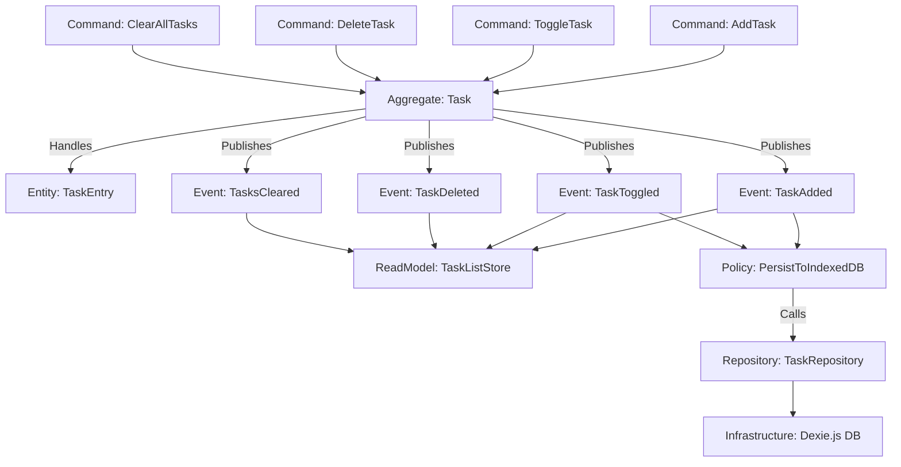

# Project Blueprint

## Technical Stack
- SvelteKit
- Dexie.js

## Technical constraints
- This is a demo, no need for full-blown backend with a RDMS (hence the Dexie.js choice)

## Domain Model

```mermaid
%% Event Storming & DDD Model for Local Task Tracker
graph TD
    %% Use Cases / Commands (Blue Post-its)
    C_AddTask[Command: AddTask] --> A_Task[Aggregate: Task]
    C_ToggleTask[Command: ToggleTask] --> A_Task
    C_DeleteTask[Command: DeleteTask] --> A_Task
    C_ClearTasks[Command: ClearAllTasks] --> A_Task

    %% Aggregates / Entities (Yellow Post-its)
    A_Task -->|Handles| E_TaskEntry[Entity: TaskEntry]

    %% Domain Events (Orange Post-its)
    A_Task -->|Publishes| DE_TaskAdded[Event: TaskAdded]
    A_Task -->|Publishes| DE_TaskToggled[Event: TaskToggled]
    A_Task -->|Publishes| DE_TaskDeleted[Event: TaskDeleted]
    A_Task -->|Publishes| DE_TasksCleared[Event: TasksCleared]

    %% Read Models / UI Stores (Green Post-its)
    DE_TaskAdded --> RM_TaskList[ReadModel: TaskListStore]
    DE_TaskToggled --> RM_TaskList
    DE_TaskDeleted --> RM_TaskList
    DE_TasksCleared --> RM_TaskList

    %% Policies / Sagas (Lilac Post-its)
    DE_TaskAdded --> P_Persist[Policy: PersistToIndexedDB]
    DE_TaskToggled --> P_Persist
    P_Persist -->|Calls| R_TaskRepo[Repository: TaskRepository]

    %% Infrastructure (White Post-its)
    R_TaskRepo --> DB_Dexie[Infrastructure: Dexie.js DB]
```