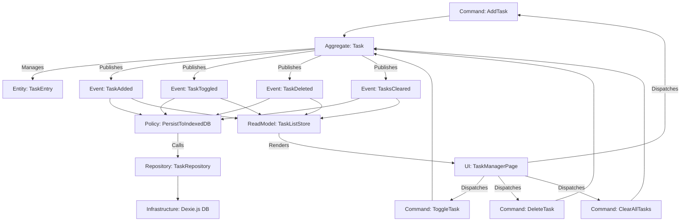

# Project Blueprint

## Project Name
LocalTaskManager

## Domain Description
A browser-only task manager that lets users add, toggle, and delete tasks. All state is persisted locally in IndexedDB via Dexie.js. There is no backend, no authentication, and no network calls.

## Technical Stack
- SvelteKit (frontend framework)
- Dexie.js (IndexedDB wrapper)
- Vitest (test runner)

## Technical Constraints
- Frontend only — no server-side rendering, no API routes, no backend.
- Persistence is handled exclusively through IndexedDB via Dexie.js.
- All tests must be fast and isolated. Mock IndexedDB in unit tests — no real DB calls.

## Project Structure
```
src/
  lib/
    db/         # Dexie.js DB setup (DB_ nodes)
    domain/     # Aggregates, Entities (A_, E_ nodes)
    events/     # Domain Events (DE_ nodes)
    commands/   # Command handlers (C_ nodes)
    policies/   # Policies / Sagas (P_ nodes)
    stores/     # Read Models / Svelte stores (RM_ nodes)
  routes/
    +page.svelte  # UI entry point (UI_ nodes)
tests/          # Vitest unit tests (mirror of src/lib/)
```

## Node Legend
All Mermaid nodes use these prefixes so the Architect agent can categorize them unambiguously:

| Prefix | DDD Type           | Example                  |
|--------|--------------------|--------------------------|
| `C_`   | Command            | `C_AddTask`              |
| `A_`   | Aggregate          | `A_Task`                 |
| `E_`   | Entity             | `E_TaskEntry`            |
| `DE_`  | Domain Event       | `DE_TaskAdded`           |
| `P_`   | Policy / Saga      | `P_PersistToIndexedDB`   |
| `R_`   | Repository         | `R_TaskRepo`             |
| `RM_`  | Read Model / Store | `RM_TaskList`            |
| `DB_`  | Infrastructure     | `DB_Dexie`               |
| `UI_`  | UI Component / Page| `UI_TaskManagerPage`     |

## Domain Model

